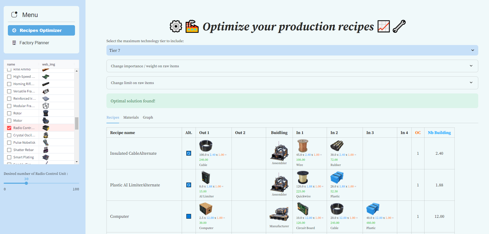
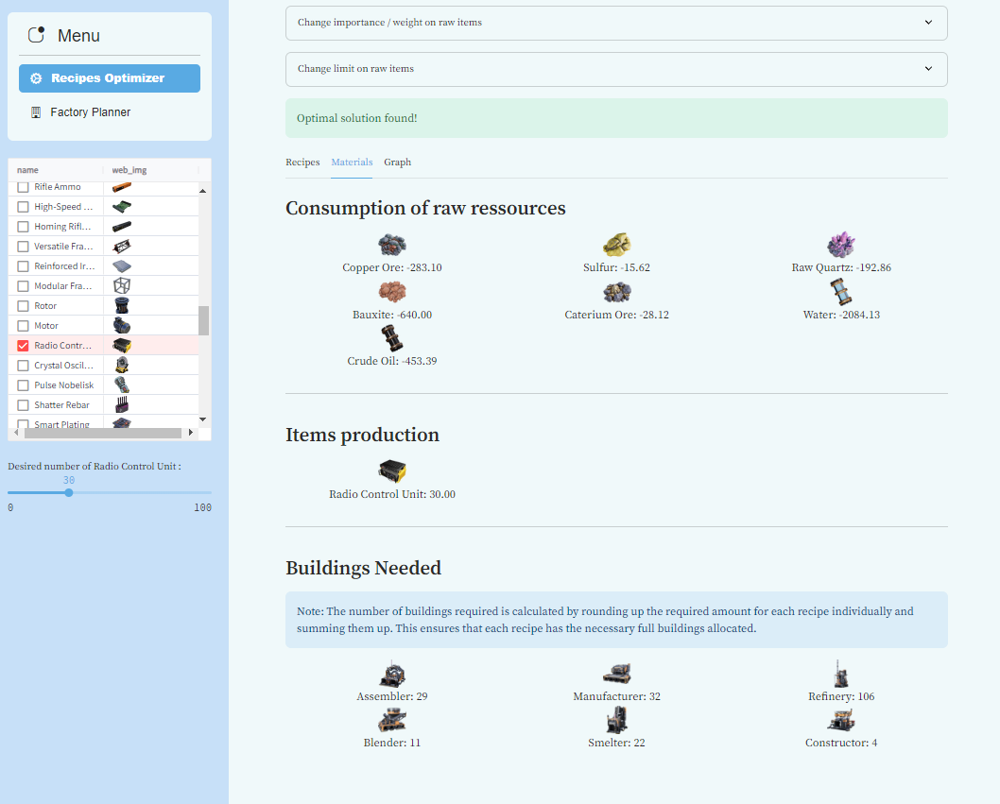
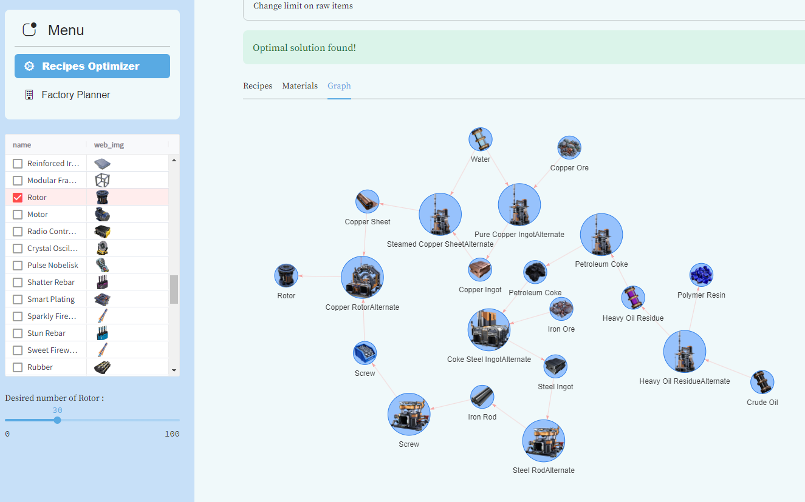

# Gestion Satisfactory

Welcome to **Gestion Satisfactory**, a comprehensive tool designed to optimize your production workflows in the game Satisfactory.
This application allows you to:

- **Optimize** recipes based on your preferences and constraints on raw materials.
- **Organize** your factories by area, factory, and production lines for better management and visibility.
- **Analyze** resource production, ensuring you're producing the right amounts and identifying any overproduction or shortages.



<table>
  <tr>
    <td align="center">
      
      <br>
      <em>Balance of Items & Buildings needed</em>
    </td>
    <td align="center">
      
      <br>
      <em>Graph view of the optimal combination of recipes</em>
    </td>
  </tr>
</table>

## Features

1. Recipe Optimization

    - Utilize optimization algorithm to find the **most efficient combination of recipes** to produce an item of your choosing.
    - Achieve **optimal resource utilization** and minimize waste.
    - Customize your production by setting preferences and limits on raw materials.

2. Factory Planning and Organization

    - Structure your production setup by areas, factories, and production lines.
    - Keep your operations clean and organized for easier management.
    - Monitor the production output of each segment to balance your workflow.

3. Resource Monitoring

    - Gain visibility into all resources being produced.
    - Identify overproduced items or shortages quickly.
    - Make informed decisions to adjust your production accordingly.

## Usage

1. Optimizing Recipes:

    - Navigate to the Recipe Optimizer section.
    - Set your preferences and limits on raw materials.
    - Select the items you wish to produce.
    - The optimizer will generate the most efficient production plan based on your inputs.

2. Planning Factories:

    - Go to the Factory Planner section.
    - Organize your production by creating areas, factories, and production lines.
    - Assign recipes and monitor the output of each segment.

## Prerequisites

### For running with Docker

- Docker
- Docker compose

### For running as standalone process

- conda

## Setup Instructions

1. Clone the Repository

    ```bash
    git clone https://github.com/Nicolas-Prevot/gestion_satisfactory.git
    cd gestion_satisfactory
    ```

2. Set Up Environment Variables

    - Copy the `default.env` file to `.env` if it doesn't exist:

        ```bash
        cp default.env .env
        ```

    - Update the `.env` file with your desired configuration.

3. Run the Webapp with/without Docker:

    - Option 1: Webapp & sqlite database without Docker

        1. Start by instanciating your *Conda* environment by running the following command:

            ```bash
            conda env create -v -f environment.yml --force
            conda activate satisfactory
            ```

        2. Install project dependencies with *Poetry*:

            ```bash
            poetry install --without dev
            ```

        3. Run the Webapp

            ```bash
            poetry run app
            ```

    - Option 2: Webapp with Docker & sqlite database

        ```bash
        docker compose up -d --build
        ```

    - Option 3: Webapp with Docker & postgres database with Docker

        ```bash
        docker compose -f docker-compose.yaml -f docker-compose.postgres.yaml up -d --build
        ```

4. Access the Application

   - Open your web browser and navigate to `http://localhost:<PORT_WEBAPP>` (the port you specified in the .env file).

Note:

If want to clean unused docker objects :

```bash
docker system prune -a --volumes
```
